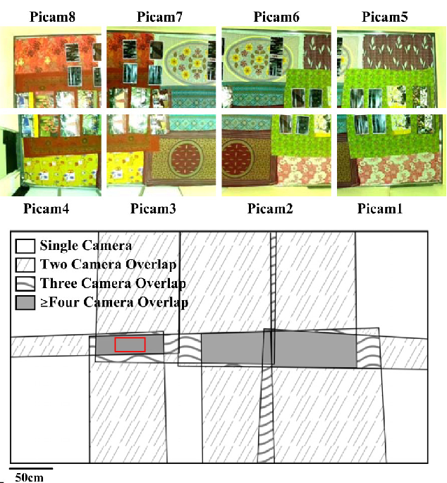

How do we go about aligning x,y position coordinates from eight different cameras covering different parts of the same environment? We are going to use a
calibration apparoach which uses a LED to figure out the perspective transformation between all pairs of cameras. Let's jump into the setup then. We have eight 
raspberry pi cameras covering a large room (16m^2). This is how each camera's field of view overlap region looks in 2D plane.

 

